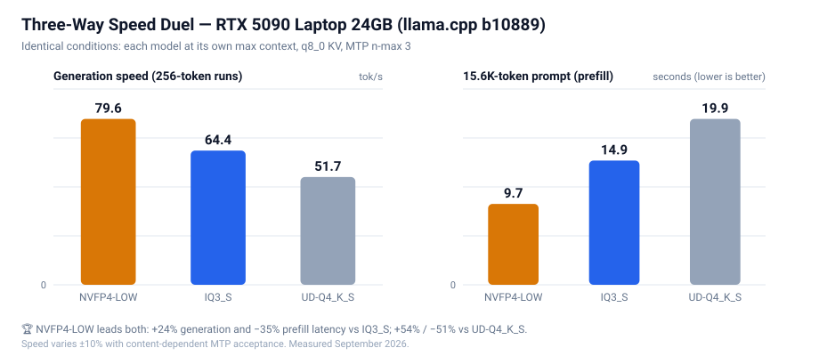
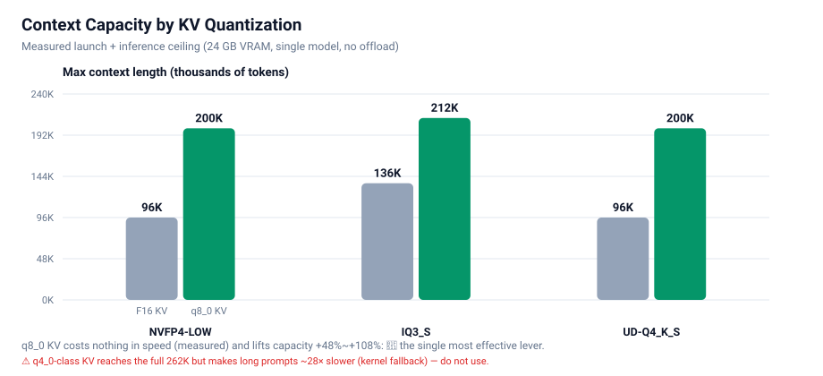
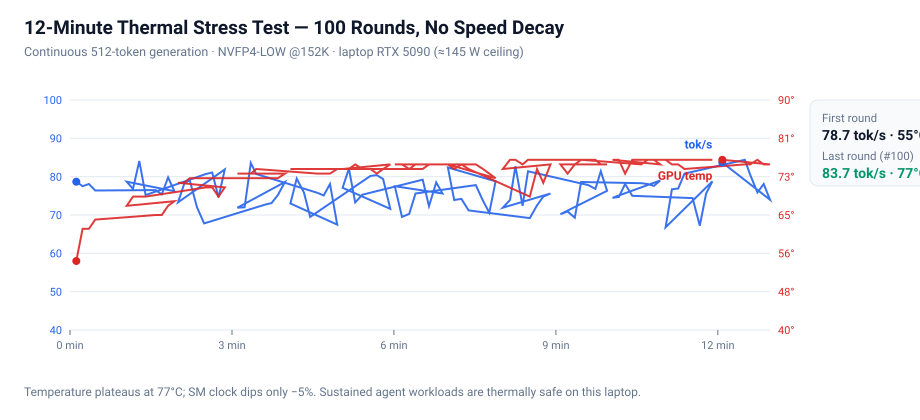
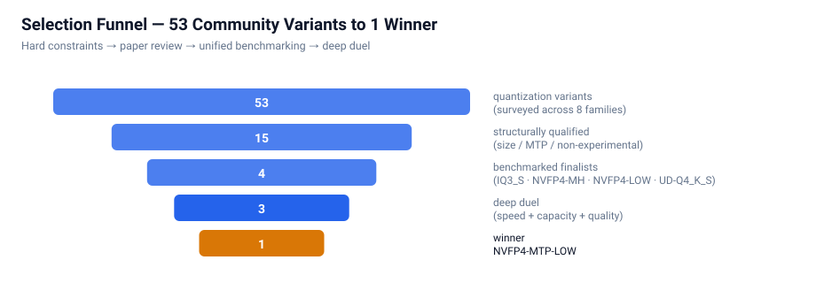

# Qwen3.8-27B on a Single 24GB GPU — Quantization & Tuning Study

**Selecting the best of 53 community quantization variants, then optimizing layer-by-layer to the hardware limit**

[中文版 →](./README.md) ｜ [Scripts →](./scripts) ｜ [Raw data →](./data)

[](https://huggingface.co/Qwen/Qwen3.8-27B)
[]()
[]()
[-2563eb)]()
[](https://github.com/ggml-org/llama.cpp/releases)
[](#license)

---

## 🏆 The Winner (read this first)

**NVFP4-MTP-LOW + 192K context + q8_0 KV + MTP n-max 3 + llama.cpp b10889**

```powershell
# One-command launch (edit the two path variables at the top of the script first)
.\scripts\start-nvfp4-low.ps1        # → http://127.0.0.1:8082
```

### Three-Way Final Duel (each model at its own optimum, same machine, same conditions)

| | 🥇 **NVFP4-LOW** | 🥈 IQ3_S | 🥉 UD-Q4_K_S |
|---|---|---|---|
| **Generation speed** | **79.6 tok/s** | 64.4 tok/s | 51.7 tok/s |
| **15.6K-token prompt** | **9.7 s** | 14.9 s | 19.9 s |
| **Max context** | 200K (192K recommended) | **212K** (240K extreme) | 200K |
| **Model size** | 14.47 GiB | **11.29 GiB** | 14.30 GiB |
| **Method** | All-NVFP4 + light heads | GSQ-RCO mixed (~3.5 bpw) | Dynamic Q4_K_S (~4.4 bpw) |
| **Quality** | Tie | Tie (**task-lossless**, academically validated) | Tie (most rigorous details) |
| **Role** | **Daily driver** ✅ | Ultra-long-context backup | Archive |

> **In one line**: NVFP4-LOW wins both speed metrics (+24% generation, −35% prompt latency vs the runner-up), and its quality gap to BF16 is unmeasurable in a community 4,800-task controlled test. IQ3_S is only worth switching to when you need 210K+ tokens of context.



---

## 📌 Three Core Findings

1. **q8_0 KV is the most underrated optimization** — zero speed cost, +56% capacity (212K), near-lossless. Meanwhile q4_0-class KV reaches the full 262K but makes long prompts **28× slower** (kernel fallback) — unusable.
2. **MTP needs no tuning** — n-max 3 is optimal on a 24GB card (2/3/4/5 and p-min all swept). High acceptance ≠ high speed.
3. **Engine gains depend on quantization type** — b10840 → b10889 gave NVFP4 +6.6% speed and +48K capacity, but K-quants −11%. **Always re-measure capacity after an engine upgrade.**

---

## 📊 Full Test Results

### 1️⃣ Context capacity: KV quantization is the lever



| Model | F16 KV ceiling | **q8_0 KV ceiling** | q4_0-class KV |
|---|---|---|---|
| IQ3_S | 136K | **212K** (240K extreme) | 262K ⚠️ 28× slower |
| NVFP4-LOW | 96K | **200K** | — |
| NVFP4-MID-HIGH | 88K | ~160K (est.) | — |
| UD-Q4_K_S | 96K | 200K | — |

**Slow-path evidence** (same 15.6K-token prompt):

| Config | Latency | Verdict |
|---|---|---|
| 32K + F16 KV | 13.6 s | Baseline |
| 136K + F16 KV | 15.2 s | No penalty |
| 200K + **q8_0** | **15.1 s** | **No penalty** ✅ |
| 262K + **q4_0-class** | **~420 s, never finished** | ❌ Kernel fallback; throughput decays 286 → 29 tok/s |

### 2️⃣ Speed duel (cross-validated on two engine builds)

| Model | Engine b10840 (old) | Engine b10889 (new) | Delta |
|---|---|---|---|
| **NVFP4-LOW** | 74.7 tok/s / 152K / 10.1s | **79.6 / 200K / 9.7s** | **+6.6%, +48K** |
| IQ3_S | 61.9 / 212K / 15.5s | 64.4 / 212K / 14.9s | +4% |
| UD-Q4_K_S | 58.3 / 152K / 15.2s | 51.7 / 200K / 19.9s | **−11%** (no benefit) |

**Why**:
- **Why LOW is fastest** — its light heads (Q5_0 output + IQ4_XS MTP) minimize read cost on every MTP verification/draft pass. The community observed the same pattern on a desktop RTX 5090.
- **Why UD has the highest acceptance (73%) yet is slowest** — K-quant's per-pass verification cost is heaviest (dequant overhead) with no FP4 acceleration.
- **NVFP4's FP4 advantage materializes only in prefill** (10 s vs 15–20 s); decode advantages come from head design, not file size.

### 3️⃣ MTP parameter sweep (cross-validated on all three models)

| Config | NVFP4-LOW | IQ3_S | UD-Q4_K_S | Verdict |
|---|---|---|---|---|
| **n-max 3** | **74.4** | **63.2** | **59.3** | 🏆 Best for all three |
| n-max 2 | 66.7 | 61.0 | 54.7 | 7–10% slower |
| n-max 4 | launch crash (short 594 MiB) | 63.5 (no gain) | untested | Unusable / no gain |
| n-max 3 + p-min 0.75 | 64.6 (acceptance inflated to 85%) | — | — | Throughput −13% |

> Key insight: **n-max 4 needs ~594 MiB extra VRAM** for its verification batch — unusable at the edge of a 24GB card, and useless even when it fits.

### 4️⃣ Quality: a three-way tie

**Same-prompt duel** (single-file Snake game, 5 explicit requirements):

| Dimension | IQ3_S | NVFP4-MID-HIGH | UD-Q4_K_S |
|---|---|---|---|
| Complete / all requirements / anti-reverse / food placement | ✅ | ✅ | ✅ |
| **Tail exclusion** (advanced detail) | ✗ | ✗ | **✅ only one** |
| Output length | 3,985 chars | 5,624 chars | 4,164 chars |
| Long-context recall (12K/70% and 150K/80% depth) | ✅ | ✅ | ✅ |

### 5️⃣ Thermal stress: 12 minutes sustained, zero decay



| Metric | Round 1 | Round 100 |
|---|---|---|
| Generation speed | 78.7 tok/s | **83.7 tok/s (no decay)** |
| GPU temp | 55 °C | 77 °C (stable plateau) |
| Power | 132 W | 145 W |
| SM clock | 1830 MHz | 1740 MHz (−5%) |

**Conclusion: laptop thermals easily handle sustained agent workloads.** Speed variance (±10%) tracks MTP acceptance randomness, not temperature.

---

## 👁 Vision Support (added 2026-09-11)

The model is a VLM; the vision component (mmproj) ships separately and can be **quantized to save VRAM**:

| Step | Command / Result |
|---|---|
| Get | `mmproj-BF16.gguf` (888 MB, from the HF Qwen3.8-27B repo) |
| **Self-quantize** | `llama-quantize mmproj-BF16.gguf mmproj-Q8_0.gguf Q8_0` → **600 MB** (recognition quality identical in testing) |

**★ Vision mode speed-vs-context curve** (non-linear cliff — note the last row):

| Context | Generation | Vision latency | Verdict |
|---|---|---|---|
| 192K | 3.9 tok/s | 47 s | ❌ |
| 160K | 20.8 tok/s | — | ❌ |
| 160K + `--ctx-checkpoints 4` | 37.2 tok/s | — | ⚠️ |
| **152K + `--ctx-checkpoints 4`** | **63.6 tok/s** | **6.1 s** | ✅ **recommended** |

> Generation speed degrades non-linearly with context (silent slow-path fallback when VRAM is tight — not an OOM). Recommended: **152K with vision**, 192K for text-only.
> Full guide + API example: [docs/vision-setup.md](docs/vision-setup.md)

## 🧠 Reasoning Effort & Budget (added 2026-09-11)

**The default `xhigh` level is a trap in API usage** (measured: zero content output; 22,021 chars of thinking burned through the 6,000-token cap):

| Config | Time | Thinking | Content | Verdict |
|---|---|---|---|---|
| xhigh, no budget | 114 s | 22,021 chars | **0** | ❌ |
| xhigh + **top-level** budget 3000 | 103 s | 10,059 | 6,386 | ✅ |
| xhigh + budget inside template kwargs | 117 s | 22,207 | 0 | ❌ silently ignored |
| **medium** | **37 s** | 826 | 4,274 | ✅ recommended |
| low | 27 s | 692 | — | ✅ fastest |

**★ Key gotcha**: `reasoning_budget_tokens` must be a **top-level request field** — putting it inside `chat_template_kwargs` is silently ignored.
> Full guide: [docs/reasoning-guide.md](docs/reasoning-guide.md)

## 🔬 Deep Verification: iMatrix & Custom Build (added 2026-09-12)

**① iMatrix mixed quant (15.95 GiB) is not worth switching to** — same-task code duel: quality tied (8/9 vs 8/9), but 27% slower generation, 48K less context, 1.5 GiB larger. **PPL advantage ≠ real-task quality advantage.**

**② Custom build exposed an upstream MTP bug** — with MSVC + CUDA 12.8 self-compilation, `--spec-type draft-mtp` makes **prefill ~57× slower** (32.7 vs 1867 tok/s, silent slowdown); official builds (Clang + CUDA 13.3) are unaffected. Filed upstream: **[ggml-org/llama.cpp#28790](https://github.com/ggml-org/llama.cpp/issues/28790)**.

**③ Engine upgrade intel** — official b10917 ≈ b10889 (prefill −9% / decode −3%, within noise) → **no upgrade needed**.

**④ Parameter scoreboard**: `--ctx-checkpoints 4` ✅ (+79%) | `--spec-default` ❌ (−39%) | `n-max 8` ❌.

> Full custom-build log: [docs/custom-build-and-mtp-bug.md](docs/custom-build-and-mtp-bug.md) | Raw data: [data/round2-new-results.md](data/round2-new-results.md)

---

## 🔍 Selection Funnel: 53 → 1



| Stage | Count | Notes |
|---|---|---|
| Ecosystem survey | **53** | 8 source families (esatapedico NVFP4 9+2+8+10 tiers, unsloth UD 20, DASLab GSQ-RCO 3, QUASAR, …) |
| Hard-constraint filter | ~15 | Removed: too large (ORIG 33GB / HIGHEST 23GB / Q8), experimental patches (8 SSMFIX), third-party fused weights (10 TURBO-Fable), no MTP head (BUDGET), too low precision (IQ1/IQ2) |
| Benchmarked finalists | 4 | IQ3_S · NVFP4-MID-HIGH · NVFP4-LOW · UD-Q4_K_S |
| Deep duel | 3 | IQ3_S · NVFP4-LOW · UD-Q4_K_S |
| **Winner** | **1** | **NVFP4-MTP-LOW** |

**Two notable exclusions** (they look prominent on HF):
- **SSMFIX series**: a community patch rescaling 8 late-layer SSM conv1d weights (hypothesis: fixing long-context degradation). Mixed evidence (TruthfulQA +6~8 pp but CMMLU −1.8, no long-context validation); the card itself says "EXPERIMENT, NOT AN IMPROVEMENT".
- **TURBO-Fable-Cold-Fusion series**: third-party fused tunes (decensored, thinking-reduced), non-official weights, self-reported benchmarks.

---

## ⚙️ Eight Reusable Lessons

1. **`reasoning_effort` is mandatory** — the default (xhigh) burned 8,000 tokens of pure thinking with zero output. Pass `{"chat_template_kwargs":{"reasoning_effort":"medium"}}`. A community 4,800-task test: xhigh burns 7–11× more tokens than low for 0–4.7 points. **Never disable reasoning** (NVFP4 collapses to 13/30 on HumanEval+ with reasoning off).
2. **q4_0-class KV has a hidden performance cliff** — best-looking capacity (262K), 28× slower long prompts.
3. **MTP is pure win on dense models** — n-max 3 gives +73~79% (the "MTP slows MoE down" experience doesn't apply).
4. **High acceptance ≠ high speed** — speed = per-pass cost × per-pass yield; light heads beat high acceptance.
5. **NVFP4's FP4 acceleration only shows in prefill** — decode is bandwidth-bound and depends on head design.
6. **Engine gains are quantization-dependent** — re-measure capacity after upgrading (NVFP4 +48K, K-quant degrades).
7. **Large contexts are unfriendly to K-quants** — LOW's prefill stays 9.7 s at 200K; UD degrades 15.2 → 19.9 s.
8. **Prompt cache is the biggest free speedup** — same 15.6K input: 15 s cold → **2.3 s warm (6.5×)**. Keep the agent conversation prefix stable.

---

## 🛠 Toolbox

Three PowerShell launchers in `scripts/` (paths parameterized; **save as UTF-8 with BOM**):

| Script | Purpose | Key flags |
|---|---|---|
| `start-nvfp4-low.ps1` | 🏆 Daily driver | `-c 192000` + q8_0 KV + MTP n-max 3 |
| `start-iq3s.ps1` | Ultra-long-context backup | `-c 212000` (up to 240K) |
| `start-nvfp4-midhigh.ps1` | Comparison group | `-c 84000` |

**Edit the two variables at the top before use**: `$ENGINE_DIR` (llama.cpp folder), `$MODELS_DIR` (model folder).

> ⚠️ Two known pitfalls (already handled in the scripts):
> 1. **Scripts must be UTF-8 with BOM** — otherwise PowerShell 5.1 mis-decodes Chinese comments and throws a "string terminator missing" error.
> 2. **b10889+ removed `--no-mmap`** — use `--load-mode none` instead.

**API requirement (all configs)**:
```json
{ "messages": [], "chat_template_kwargs": { "reasoning_effort": "medium" } }
```
Thinking sampling `temp 1.0 / top_p 0.95 / top_k 20`; instruct sampling `temp 0.7 / top_p 0.80 / top_k 20`.

---

## ❓ FAQ

**Q: Why not the full 262K (the model's native maximum)?**
A: It works, but only with q4_0-class KV, which makes long prompts 28× slower (kernel fallback). 192K + q8_0 is the sweet spot across capacity, speed, and quality.

**Q: Does q8_0 KV hurt quality?**
A: Measured and widely reported as near-lossless. Our long-context recall tests (12K/70% and 150K/80% depth) all passed with q8_0 KV.

**Q: Why not Q6/Q8 quants for higher accuracy?**
A: They don't fit 24GB (Q8_0 is 27 GiB). 4-bit is the quality ceiling for this hardware class — community controlled testing shows 4-bit statistically ties FP8 at task level.

**Q: LOW's heads (Q5_0 / IQ4_XS) are lower precision than MID-HIGH's (all Q8_0). Is quality really equal?**
A: Author's PPL: LOW 3.2761 / MEDIUM 3.2858 / MID-HIGH 3.2903 (within error bars; LOW slightly better). Code duel: three-way tie. Head precision affects PPL far less than the backbone.

**Q: How much faster is a desktop 5090?**
A: The 145 W power ceiling here is laptop-specific; a desktop 5090 (575 W) is typically 2–3× faster at prefill and 1.5–2× at decode. **Capacity conclusions (KV quantization, context ceilings) transfer directly.**

**Q: What about 16GB cards?**
A: Use a smaller tier (e.g. NVFP4 COMPACT-LOW 15.2 GB, or the MTP-less BUDGET/STARVED at 14.6 GB), q8_0 KV, context capped near 96K; or IQ3_S (11.3 GB) with more context.

**Q: Does it support image input?**
A: Yes (native VLM). Download `mmproj-BF16.gguf` (~0.87 GB) and pass `--mmproj`; it costs about 1 GB extra VRAM.

**Q: Can I run multiple instances?**
A: 24GB won't hold two 27B instances. Switch configs instead (~30 s, three launchers provided).

**Q: Why llama.cpp instead of vLLM / SGLang?**
A: On Blackwell laptops, their VRAM management and GGUF quantization ecosystem are less flexible, and community NVFP4 weights ship mainly as GGUF. vLLM suits server-side multi-concurrency.

---

## 📚 References & Further Reading

**Models & quants**
- [Qwen/Qwen3.8-27B](https://huggingface.co/Qwen/Qwen3.8-27B) — base model (Apache-2.0)
- [esatapedico/Qwen3.8-27B-NVFP4-MTP-GGUF](https://huggingface.co/esatapedico/Qwen3.8-27B-NVFP4-MTP-GGUF) — the winning model's family (9 tiers)
- [unsloth/Qwen3.8-27B-GGUF](https://huggingface.co/unsloth/Qwen3.8-27B-GGUF) — UD dynamic quant family
- DASLab GSQ-RCO — search HuggingFace for `DASLab Qwen3.8-27B GSQ-RCO`

**Engine**
- [llama.cpp releases](https://github.com/ggml-org/llama.cpp/releases) — grab both the Windows CUDA main package and the cudart package, unzip into one folder
- MTP support: add `--spec-type draft-mtp`

**Related project**
- [Qwen3.8-Flash-Next 177B deployment log](https://github.com/lifeidle/qwen3.8-flash-next-5090-laptop-256k) — MoE deployment on the same platform (three-tier memory split, 256K context)

---

## 🔧 Troubleshooting

| Symptom | Cause & fix |
|---|---|
| Exits immediately, empty log | Incompatible flag. Newer builds removed `--no-mmap` — use `--load-mode none` |
| `failed to allocate buffer for kv cache` | Context exceeds VRAM. Lower `-c` or use q8_0 KV |
| Launches but inference hangs | VRAM too tight (<200 MiB free). Reduce context by 8–16K |
| Output is all thinking, no answer | Missing `reasoning_effort`; default xhigh burns the budget |
| Script error "string terminator missing" | Save the script as UTF-8 with BOM |
| Mojibake output | Request body not UTF-8 — write a JSON file and `curl --data-binary @file` |

---

## Reproduction

```powershell
# 1. Engine: download the llama.cpp Windows CUDA packages (main + cudart), unzip into one folder
# 2. Model: download the GGUF from the links above (hf-mirror.com works as a mirror)
# 3. Launch: edit the two path variables, then run
.\scripts\start-nvfp4-low.ps1
# 4. Verify
curl http://127.0.0.1:8082/health     # expect {"status":"ok"}
```

**Acceptance baseline**: 256-token generation should reach **75–85 tok/s** (variance from MTP acceptance); a 15.6K-token prompt prefills in ~10 s.

---

## Data Notes

- All speeds are multi-run samples; ±10% variance is normal (MTP acceptance depends on content)
- Capacity figures are measured extremes with successful inference; "launch OK but inference crash" cases are labeled
- Tested September 2026 · RTX 5090 Laptop 24GB · Windows 11 · llama.cpp b10840 / b10889
- Raw thermal data (100 rounds) and all speed data are in [`data/`](./data)

## License

- Documentation: CC BY 4.0 ｜ Scripts: MIT (see [LICENSE](./LICENSE))
- Model weights follow upstream licenses (Qwen3.8-27B family is Apache-2.0)

## Acknowledgements

**Alibaba / Qwen team** (base model) · **unsloth** (NVFP4 quantization method, dynamic quant family) · **DASLab** (GSQ-RCO academic quantization) · **esatapedico** (NVFP4-MTP GGUF packaging and transparent model cards) · **llama.cpp community** (engine and MTP support)
